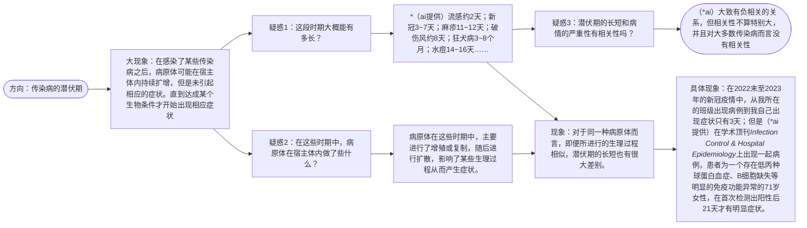

# 流程图原稿

```mermaid
flowchart LR

S([方向：传染病的潜伏期])

P0[大现象：在感染了某些传染病之后，病原体可能在宿主体内持续扩增，但是未引起相应的症状。直到达成某个生物条件才开始出现相应症状]

I1[*（ai提供）流感约2天；新冠3~7天；麻疹11~12天；破伤风约8天；狂犬病3~8个月；水痘14~16天……]
I2[病原体在这些时期中，主要进行了增殖或复制，随后进行扩散，影响了某些生理过程从而产生症状。]
I3[现象：对于同一种病原体而言，即便所进行的生理过程相似，潜伏期的长短也有很大差别。]


Q1[疑惑1：这段时期大概能有多长？]
Q2[疑惑2：在这些时期中，病原体在宿主体内做了些什么？]
Q3[疑惑3：潜伏期的长短和病情的严重性有相关性吗？]

E1([（*ai）大致有负相关的关系，但相关性不算特别大，并且对大多数传染病而言没有相关性])
E2[具体现象：在2022末至2023年的新冠疫情中，从我所在的班级出现病例到我自己出现症状只有3天；但是（*ai提供）在学术顶刊<i>Infection Control & Hospital Epidemiology</i>上出现一起病例，患者为一个存在低丙种球蛋白血症、B细胞缺失等明显的免疫功能异常的71岁女性，在首次检测出阳性后21天才有明显症状。]

S --> P0 --> Q1 --> I1 --> Q3 --> E1
I1 --> I3
P0 --> Q2 --> I2 --> I3 --> E2

```
